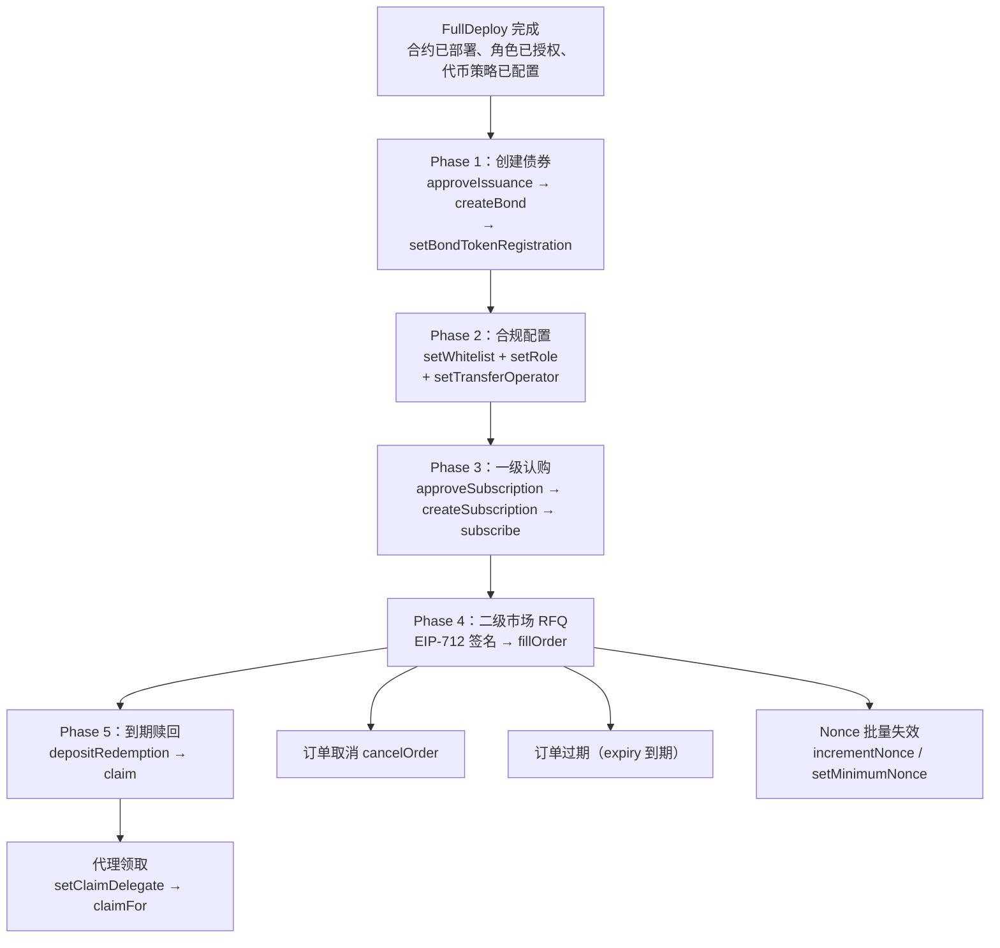

# BondDEX RFQ — 部署后操作手册

本文档说明 `FullDeploy` 完成后，如何从零开始让系统进入完整的业务运转状态。

---

## 总览：部署后全流程



---

## Phase 0：部署完成状态

`FullDeploy` 执行后，`deployments/{chainId}.json` 包含如下信息：

| 字段 | 含义 |
|------|------|
| `contracts.bondFactory` | BondFactory 地址（不可升级） |
| `contracts.bondIssuance` | BondIssuance 代理地址（UUPS 可升级） |
| `contracts.rfqSettlement` | RFQSettlement 代理地址（UUPS 可升级） |
| `contracts.complianceImplementation` | ComplianceModule 实现模板（已注册到 Factory） |
| `configuration.settlementTokens` | 已配置的结算代币及其策略 |
| `configuration.feeConfig` | RFQ 手续费配置 |
| `configuration.aiToleranceSeconds` | 应计利息验证容差（秒），从链上读取 |
| `roles` | 各合约的角色持有者 |

**已完成的初始化：**
1. ComplianceModule 实现已注册到 Factory
2. 结算代币（如 USDC）已在 BondIssuance 和 RFQSettlement 上启用
3. RFQ 手续费（feeRecipient + currentFeeBps + maxFeeBps）已配置
4. 各合约角色已授权给配置中指定的地址
5. deployer 权限已选择性撤销（如配置 `revokeDeployer: true`）

---

## Phase 1：创建债券

### 1.1 审批发行

由 `ISSUANCE_APPROVER_ROLE` 持有者调用：

```solidity
factory.approveIssuance(
    bytes32 approvalId,           // 唯一审批 ID（自定义，如 keccak256("bond-2026-001")）
    address issuer,               // 发行人地址
    address complianceImplementation, // 合规模板地址（必须已在 Factory 注册）
    uint256 expiresAt,            // 审批有效期（Unix 时间戳，0 = 永不过期）
    bytes32 metadataHash          // 必须 = factory.hashBondConfig(config)（见下方 AUDIT-FIX N3）
);
```

**前置条件：** `complianceImplementation` 必须先通过 `registerComplianceImplementation` 注册，否则 `approveIssuance` 会 revert `UnsupportedInterface`。

**🔒 AUDIT-FIX(N3) — 强制 BondConfig 整型绑定：** 自审计修复批次起，`metadataHash` 不再是任意自定义值，而是**必须**等于
`BondFactory.hashBondConfig(config) == keccak256(abi.encode(config))`。审批方需要在调 `approveIssuance` 之前先与发行人确定一份完整的 `BondConfig`，离线/链上调用 `hashBondConfig(config)` 取得规范哈希，再将该哈希提交。如果 `createBond` 时提交的 `BondConfig` 任意一个字段（faceValue / couponRateBps / settlementToken 等）与审批阶段的 hash 不一致，将 revert `BondConfigHashMismatch(expected, provided)`。

```bash
# 链下计算 metadataHash（cast 示例，把 $CFG 替换为 BondConfig 对应的 ABI tuple）
HASH=$(cast call $FACTORY 'hashBondConfig((address,string,string,uint8,uint256,uint256,uint256,address,uint8,address,bytes32,uint256,uint256,uint8,uint8,uint8,bytes12))' "$CFG")
factory.approveIssuance(approvalId, issuer, complianceImpl, expiresAt, $HASH);
```

**状态枚举：** `ApprovalStatus`：`NONE=0`（未使用）, `ACTIVE=1`, `CONSUMED=2`, `REVOKED=3`, `EXPIRED=4`。每个 `approvalId` 只能使用一次，不可覆写已有记录。

### 1.2 创建债券

由**发行人本人**调用（必须与 approvalId 中记录的 issuer 一致）：

```solidity
BondConfig memory config = BondConfig({
    issuer: 0x...,                    // 必须等于 msg.sender
    name: "HashKey Bond 2026-Q1",     // 债券名称
    symbol: "HKB-Q1",                 // 债券符号
    decimals: 0,                      // 债券精度（0 = 整数 bond, 18 = 标准）
    faceValue: 1_000e6,              // 面值（结算代币最小单位，如 1000 USDC = 1_000_000_000）
    couponRateBps: 500,              // 年化票息率 bps（500 = 5%/年，上限 10000）
    maturityTimestamp: 1735689600,    // 到期时间（Unix 时间戳）
    issueDate: 1704067200,            // 发行日（Unix 时间戳）— 用于计算应计利息的起算点
    dayCountConvention: DayCountConvention.ACT_365, // 计息惯例（ACT_365 / ACT_360）
    couponFrequency: CouponFrequency.BULLET,        // 票息支付频率（BULLET / ANNUAL）
    bondCategory: BondCategory.CORPORATE,           // 债券类别（CORPORATE / GOVERNMENT / CONVERTIBLE / ABS）
    isin: bytes12(0),                // ISIN 代码（12 字节，留空则为零值）
    settlementToken: 0x...,          // 结算代币地址（必须已在平台启用）
    settlementTokenDecimals: 6,      // 结算代币精度（链下参考）
    complianceImplementation: 0x..., // 合规模板（必须与审批中一致且已注册）
    policyId: keccak256("policy-1"), // 合规策略 ID
    policyVersion: 1                 // 合规策略版本
});

(address bondToken, address complianceModule) = factory.createBond(config, approvalId);
```

**新增字段说明：**

| 字段 | 类型 | 说明 |
|------|------|------|
| `issueDate` | `uint256` | 债券发行日（Unix 时间戳），应计利息从此日开始累计 |
| `dayCountConvention` | `enum` | 计息惯例：`ACT_365`（实际天数/365）、`ACT_360`（实际天数/360） |
| `couponFrequency` | `enum` | 付息频率：`BULLET`（到期一次性，最常见）、`ANNUAL`（每年）。本平台暂不支持 SEMI_ANNUAL / QUARTERLY |
| `bondCategory` | `enum` | 债券类别：`CORPORATE`（公司债）、`GOVERNMENT`（政府债）、`CONVERTIBLE`（可转债）、`ABS`（资产支持证券） |
| `isin` | `bytes12` | 国际证券识别码，12 字节，留空传 `bytes12(0)` |

**couponRateBps 语义说明：**

`couponRateBps` 是**年化利率**（基点）。赎回时合约按照配置的 `dayCountConvention` 进行日期折算：

```
持有秒数 = effectiveTs - issueDate（effectiveTs = min(timestamp, maturityTimestamp)）
利息     = principal × couponRateBps × 持有秒数 / (10000 × yearSeconds)
         其中 yearSeconds = ACT_365 ? 365 days : 360 days
```

> **示例：** `dayCountConvention = ACT_365` + `couponRateBps = 500` 表示年化 5%；持有 1 年（365 天）的应计利息约为本金的 5%，持有 182 天约为 2.5%。
>
> **🔒 AUDIT-FIX(N7) 高精度计息**：v0.3.0 的应计利息计算使用 `BondToken.accruedInterestFor(bondAmount, timestamp)`（延迟除法的 mulDiv 公式），避免早期版本"先除后乘"导致的精度截断。链下计算请保持与链上公式一致以通过 RFQ 容差校验。

**decimals 说明：**
- `decimals = 0`：每个 bond 为一个整数单位，适合面值计价场景（如 1 bond = 1000 USDC 面值）
- `decimals = 18`：标准精度，适合需要分割的场景
- 认购时 `cost = Math.mulDiv(unitPrice, units, 10^decimals, Ceil)`，decimals=0 时简化为 `unitPrice * units`

**事件：** `createBond` 在同一笔交易中发出两个事件：

- `BondCreated(bondToken indexed, issuer indexed, complianceModule indexed, name, symbol, decimals, faceValue, couponRateBps, maturityTimestamp, settlementToken, issueDate)` — 核心标识 + 关键参数
- `BondMetadata(bondToken indexed, dayCountConvention, couponFrequency, bondCategory, isin)` — 扩展属性

> 通过 `factory.getBondAddresses(approvalId)` 查询 `approvalId → (bondToken, complianceModule)` 映射。

**输出：**
- `bondToken` — 新部署的 BondToken ERC-20 地址
- `complianceModule` — 该债券专属的 ComplianceModule 代理地址

### 1.3 注册债券到 RFQ 结算

创建债券后，需要将 bondToken 注册到 RFQSettlement 才能进行二级市场交易。由 `SETTLEMENT_ADMIN_ROLE` 持有者调用：

```solidity
settlement.setBondTokenRegistration(bondTokenAddress, true);
```

未注册的 bondToken 无法出现在 RFQ 订单中（`fillOrder` 会 revert `UnregisteredBondToken`）。这是一道安全防线，防止恶意用户用假的 bondToken 地址签署订单来骗取对手方的报价代币。

**查询是否已注册：**

```solidity
bool registered = settlement.isBondTokenRegistered(bondTokenAddress);
```

---

## Phase 2：合规配置

每支债券有独立的 ComplianceModule。由该模块的 `COMPLIANCE_ADMIN_ROLE` 持有者操作。

### 2.1 设置白名单

```solidity
// 单个
complianceModule.setWhitelist(account, true);

// 批量
address[] memory accounts = new address[](3);
accounts[0] = issuer;
accounts[1] = maker;
accounts[2] = investor;
bool[] memory allowed = new bool[](3);
allowed[0] = true;
allowed[1] = true;
allowed[2] = true;
complianceModule.batchSetWhitelist(accounts, allowed);
```

### 2.2 设置角色

```solidity
// Role 枚举: NONE=0, ISSUER=1, MARKET_MAKER=2, INVESTOR=3
complianceModule.setRole(issuer, Role.ISSUER);        // 1
complianceModule.setRole(maker, Role.MARKET_MAKER);    // 2
complianceModule.setRole(investor, Role.INVESTOR);     // 3
```

### 2.3 注册授权转账 operator

**（必须步骤）** 每支新债券创建后，必须将 RFQSettlement 注册为该债券 ComplianceModule 的授权转账 operator。否则所有 RFQ 交易都会因 `TransferRestricted(8) / UNAUTHORIZED_OPERATOR` 失败。

由 `COMPLIANCE_ADMIN_ROLE` 持有者调用：

```solidity
// 注册 RFQSettlement 为授权 operator（允许 RFQ 结算合约移动债券）
complianceModule.setTransferOperator(rfqSettlementAddress, true);
```

**为什么需要这一步？** 合规模块强制所有用户间债券转账必须通过平台授权的合约执行，防止用户绕过 RFQ 结算私下交易（逃避手续费和应计利息验证）。只有授权 operator（如 RFQSettlement）发起的 `transferFrom` 才能通过合规检查；用户直接调用 `transfer` 或 `transferFrom` 会被拒绝。

**查询 operator 状态：**

```solidity
bool authorized = complianceModule.isTransferOperator(rfqSettlementAddress);
```

**撤销 operator：**

```solidity
complianceModule.setTransferOperator(rfqSettlementAddress, false);
```

> **注意：** mint（认购铸造）和 burn（赎回销毁）不受 operator 限制——这些操作的 from/to 为 `address(0)`，在 BondToken 层面直接放行，不经过合规模块的 operator 检查。

### 2.4 角色组合规则

| 发送方 | 接收方 | 允许? | 说明 |
|--------|--------|-------|------|
| MARKET_MAKER | INVESTOR | 是 | 最常见的交易方向 |
| INVESTOR | MARKET_MAKER | 是 | 投资者出售 |
| MARKET_MAKER | MARKET_MAKER | 是 | 做市商间交易（免手续费） |
| INVESTOR | INVESTOR | **否** | 禁止投资者间直接转让 |

> **转账限制说明：** 上述方向限制仅适用于通过授权 operator（RFQSettlement）执行的转账。用户无法绕过 operator 直接转账债券代币。

---

## Phase 3：一级认购

### 3.1 审批认购窗口

由 `ISSUANCE_APPROVER_ROLE` 持有者调用（与债券发行审批类似的管控模式）：

```solidity
issuance.approveSubscription(
    bytes32 approvalId,          // 唯一审批 ID（自定义，如 keccak256("sub-2026-001")）
    address issuer,              // 发行人地址
    address bondToken,           // 债券代币地址
    uint256 maxUnits,            // 最大发行量上限（必须 > 0）
    uint256 expiresAt            // 审批有效期（Unix 时间戳，0 = 永不过期，非零时必须 > block.timestamp）
);
```

**约束：** `approvalId` 必须从未被使用过；`expiresAt` 如非零则必须是未来时间，否则 revert `ExpiredDeadline`。

### 3.2 创建认购窗口

由**发行人**调用（需要先获得管理员审批）：

```solidity
SubscriptionTerms memory terms = SubscriptionTerms({
    bondToken: bondTokenAddress,
    settlementToken: usdcAddress,
    unitPrice: 1_000e6,       // 每个 bond unit 的价格（结算代币最小单位）
    maxUnits: 1_000,          // 最大发行量（decimals=0 时为整数，不能超过审批上限）
    opensAt: block.timestamp, // 开始时间
    closesAt: block.timestamp + 7 days // 结束时间（0 = 无截止）
});

bytes32 offerId = issuance.createSubscription(terms, approvalId);
```

**约束：**
- `terms.maxUnits` 不能超过审批记录中的 `maxUnits` 上限
- `terms.bondToken` 必须与审批记录中的 `bondToken` 一致
- `msg.sender` 必须与审批记录中的 `issuer` 一致
- 每个审批只能使用一次（消费后状态变为 CONSUMED）
- 债券未到期（`block.timestamp < maturityTimestamp`），否则 `BondAlreadyMatured`

**注意：** `subscribe()` 同样会检查债券是否已到期，到期后无法再认购。

### 3.3 做市商认购

**前置条件：**
1. 做市商已白名单 + MARKET_MAKER 角色
2. 做市商持有足够结算代币（USDC）
3. 做市商已对 BondIssuance 合约 approve 足够 USDC

```solidity
// 做市商操作
usdc.approve(address(issuance), cost);
issuance.subscribe(offerId, 800); // 认购 800 个 bond units（decimals=0）
```

**资金流向：**
结算代币 → 发行人地址（直接转给 issuer）
BondToken → mint 给做市商

**查询剩余额度：**

```solidity
(, , , uint256 maxUnits, uint256 soldUnits, , , ) = issuance.getSubscription(offerId);
uint256 remaining = maxUnits - soldUnits;
```

### 3.4 关闭认购 / 撤销审批

```solidity
// 关闭认购窗口（发行人调用）
issuance.closeSubscription(offerId);

// 撤销未使用的认购审批（ISSUANCE_APPROVER_ROLE 调用）
issuance.revokeSubscriptionApproval(approvalId);
```

> 如果认购参数设置错误，发行人应先 `closeSubscription` 关闭当前认购，然后重新申请审批并创建新的认购窗口。

---

## Phase 4：二级市场 RFQ

### 4.1 EIP-712 签名（链下）

> **⚠️ 重大变更：EIP-712 VERSION 已从 `"1"` 升级至 `"2"`**
>
> 所有基于 version `"1"` 的历史签名**立即失效**，无法用于 `fillOrder`。前端、后端及 SDK 必须同步更新 domain separator 中的 `version` 字段。

Maker 构造 Order 并用 EIP-712 TypedData 签名：

```
EIP712Domain:
  name: "BondDEX RFQSettlement"
  version: "2"                    ← 已从 "1" 升级
  chainId: {当前链 ID}
  verifyingContract: {RFQSettlement 代理地址}

Order:
  maker: address           // 签名者
  taker: address           // 指定 taker（0x0 = 任何人）
  bondToken: address       // 债券代币地址（必须已在 RFQSettlement 注册）
  quoteToken: address      // 报价代币地址（如 USDC）
  bondAmount: uint256      // 债券数量
  quoteAmount: uint256     // 报价代币数量（净额，即 dirty price 减去应计利息前的本金部分）
  accruedInterest: uint256 // 应计利息（报价代币最小单位）— 新增字段
  side: uint8              // 0=BUY（taker 买入债券）, 1=SELL（taker 卖出债券）
  expiry: uint256          // 过期时间
  nonce: uint256           // maker nonce（必须 >= nonceFloor）
  salt: uint256            // 随机盐（防重复）
  maxFeeBps: uint16        // maker 允许的最高协议费率 bps（如 100 = 1%）
```

**应计利息（accruedInterest）字段说明：**

`accruedInterest` 由 Maker 链下计算并填入。`fillOrder` 执行时合约会按链上公式重新计算应计利息，与订单值进行对比，若差距超过容差（`aiToleranceSeconds`）则 revert。

手续费基于**全额（dirty amount = quoteAmount + accruedInterest）**计算：

```
dirtyAmount = quoteAmount + accruedInterest
fee = dirtyAmount × currentFeeBps / 10000
```

**手续费保护：** `maxFeeBps` 纳入 EIP-712 签名，执行时若 `currentFeeBps > maxFeeBps` 则 revert `FeeExceedsOrderLimit`。maker 可通过此字段锁定签名时的费率预期，防止管理员在签名后、成交前修改费率。

> **注意：** `maxFeeBps` 只保护签名方（maker）。当 taker 是实际承担手续费的做市商（例如 BUY 订单中 maker=Investor, taker=MM）时，taker 需要在提交 `fillOrder` 前自行通过 `feeConfig()` 确认当前费率可接受。

### 4.2 执行订单

**前置条件：**
- 债券代币已通过 `setBondTokenRegistration` 注册到 RFQSettlement
- 报价代币已在 RFQSettlement 启用
- 双方均已白名单 + 合规角色
- 付款方已对 RFQSettlement approve 足够代币
- 订单未过期、未消费、未取消

```solidity
// 单笔
settlement.fillOrder(order, signature);

// 批量（原子执行，全成功或全失败，上限 24 笔）
settlement.batchFillOrders(orders, signatures);
```

### 4.3 手续费规则

| maker 角色 | taker 角色 | 手续费 |
|-----------|-----------|--------|
| MARKET_MAKER | INVESTOR | currentFeeBps（从 MM 侧扣） |
| MARKET_MAKER | MARKET_MAKER | **0**（免手续费） |
| INVESTOR | MARKET_MAKER | currentFeeBps（从 MM 侧扣） |

手续费始终由做市商承担，且**基于 dirty amount（quoteAmount + accruedInterest）计算**：
- BUY 单（taker 买债券）：maker=MM 收到 `dirtyAmount - fee`
- SELL 单（taker 卖债券）：maker=MM 支付 `dirtyAmount + fee`

**手续费计算（以 30 bps 为例）：**

```
dirtyAmount = quoteAmount + accruedInterest
fee = Math.mulDiv(dirtyAmount, 30, 10000)

例：quoteAmount = 19,500 USDC，accruedInterest = 500 USDC
dirtyAmount = 20,000 USDC
fee = 20,000,000,000 * 30 / 10,000 = 60,000,000 = 60 USDC
```

**预估手续费：**

```solidity
// bondToken 必须已通过 setBondTokenRegistration 注册，否则 revert UnregisteredBondToken
// quoteAmount 传入 dirty amount（含应计利息）
uint256 fee = settlement.quoteFee(bondToken, partyA, partyB, dirtyAmount);
```

### 4.4 订单取消

```solidity
// 单笔取消（仅 maker 可调用）
settlement.cancelOrder(order);

// 批量取消（上限 24 笔）
settlement.batchCancelOrders(orders);
```

### 4.5 Nonce 管理

```solidity
// 递增 nonce floor（使所有 nonce < newFloor 的订单失效）
settlement.incrementNonce();

// 跳跃到指定 nonce（必须大于当前值）
settlement.setMinimumNonce(100);
```

### 4.6 订单过期

订单中 `expiry` 字段为 Unix 时间戳。`block.timestamp > expiry` 时自动拒绝执行，无需链上取消。

---

## Phase 5：到期赎回

### 5.1 发行人存入赎回资金

> **重要：** 平台链下审批流程**强制要求发行人一次性或分批存入全额赎回资金**（所有流通份数 × 每份赎回金额）。链上合约不限制部分存入，但平台运营保证资金充足性。不会出现发行人只存入部分赎回款的情况。

债券到期后，发行人将赎回资金存入 BondIssuance：

```solidity
// 发行人操作
usdc.approve(address(issuance), totalPayout);
issuance.depositRedemption(bondTokenAddress, totalPayout);
```

**赎回金额计算（年化利率 + 日期折算，decimals=0 时）：**

```
持有天数  = (maturityTimestamp - issueDate) / 86400
年化因子  = 持有天数 / 约定分母（ACT_365 → 365，ACT_360 → 360）

principal = bondAmount × faceValue
interest  = principal × couponRateBps / 10000 × 年化因子
payout    = principal + interest

例：100 bonds, faceValue=1000 USDC, couponRateBps=500 (5%/年)
    issueDate=2026-01-01, maturityTimestamp=2027-01-01 (持有365天, ACT_365)
  年化因子  = 365 / 365 = 1.0
  principal = 100 × 1,000,000,000 = 100,000 USDC
  interest  = 100,000 × 500 / 10000 × 1.0 = 5,000 USDC
  payout    = 105,000 USDC

例：100 bonds, 持有 182 天 (ACT_365, coupon=5%/年)
  年化因子  = 182 / 365 ≈ 0.49863
  interest  = 100,000 × 500 / 10000 × (182/365) ≈ 2,493 USDC
```

> **与旧版区别：** 旧版 `couponRateBps` 视为持有期总利率（直接乘以本金），新版为**年化利率**，按 `issueDate` 到 `maturityTimestamp` 的实际天数折算（ACT_365 或 ACT_360）。迁移已有债券时请重新核算参数。

**赎回金额计算（decimals=18 时）：**

```
principal = bondAmount × faceValue / 10^18
interest  = principal × couponRateBps / 10000 × 年化因子
payout    = principal + interest
```

### 5.2 持有人领取

```solidity
// 持有人自己领取
issuance.claim(bondTokenAddress);
```

**前置条件：** 持有人必须仍在该债券的白名单中。如果持有人因合规原因被移出白名单，`claim` 和 `claimFor` 均会 revert `NotWhitelisted`。合规管理员可重新将其加入白名单以恢复领取资格。

**效果：** burn 全部持有的 BondToken → 发放对应 payout 到持有人地址

### 5.3 代理领取

```solidity
// 持有人授权代理人
issuance.setClaimDelegate(delegateAddress);

// 代理人代为领取（资金仍发给持有人，不是代理人）
issuance.claimFor(bondTokenAddress, holderAddress);
```

### 5.4 多余资金救援

如果 issuer 存入了多余的赎回资金，admin（或自动路径）可以将多余部分**直接退还给 issuer**。

**🔒 AUDIT-FIX(N6) — 自动转回发行人：** 自审计修复批次起，`releaseExcessRedemption` 与 `_claimFor` 的"全部赎回后自动释放"分支会同时执行：
1. 在内部账上把超额从 `_totalRedemptionLiability` / `state.fundedAmount` 减计；
2. 立即 `safeTransfer` 把超额 settlement token 转回 `bondToken.issuer()`；
3. 顺序触发 `ExcessRedemptionReleased` 与 `ExcessRedemptionRefunded` 两个事件。

**自动释放：** 当某支债券的所有持有人都完成赎回（`totalSupply == 0`）后，自动调用 `_refundExcessToIssuer`，无需人工介入。运维侧只需监听 `ExcessRedemptionRefunded(bondToken, settlementToken, issuer, excessAmount)` 事件做财务对账。

**主动释放（部分赎回场景）：** 如果部分持有人尚未赎回，但 issuer 确实多存了资金，admin 可以主动调用 `releaseExcessRedemption`，资金同样会原子性退回 issuer：

```solidity
// DEFAULT_ADMIN_ROLE 调用，仅到期后可用
// 自动计算实际负债 = 未赎回 bond 数量 × 每 bond 赎回金额
// 释放 = (已存 - 已领) - 实际负债 → 直接转回 bondToken.issuer()
issuance.releaseExcessRedemption(bondTokenAddress);
```

**`rescueTokens` 用法已收窄：** N6 修复后，正常发行/赎回流程不再依赖 `rescueTokens` 退还超额。该函数只用于"误转入"场景（其他人误把代币转到 BondIssuance 合约），且仍然受 `_totalRedemptionLiability` 守护，最多只能提取 `contractBalance - totalLiability` 的差额：

```solidity
// DEFAULT_ADMIN_ROLE 调用 — 仅用于救援误转入资金，不再用于退还 issuer 超额
issuance.rescueTokens(tokenAddress, recipient, amount);
```

**🔒 AUDIT-FIX(N5) — 受制裁持有人的强制赎回：** 当持有人因合规事件被移出白名单后，admin 可调用 `forceRedeem` 把其债券强制销毁并把等额 settlement token 转入指定地址（监管托管 / 发行人钱包），避免负债永久死锁：

```solidity
// DEFAULT_ADMIN_ROLE 调用，债券到期后可用
// 跳过 holder 白名单检查，由 admin 直接处置
issuance.forceRedeem(bondTokenAddress, holderAddress, recipientAddress);
```

会触发 `ForceRedemption(bondToken, holder, recipient, bondAmount, payout, operator)` 事件。

**安全保护：** 合约按 settlement token 汇总追踪所有 bond 系列的赎回负债（`_totalRedemptionLiability`）。`rescueTokens` 仅允许提取 `contractBalance - totalLiability` 的差额。`releaseExcessRedemption` / `_claimFor` / `forceRedeem` 基于链上 `totalSupply` 精确计算实际负债，确保未赎回持有人的资金不受影响。

**🔒 AUDIT-FIX(N11) — settlement token 关停受限：** `setSettlementTokenPolicy` 现在禁止在 `_totalRedemptionLiability[token] > 0` 时把该 token 的 redemption 通道关闭，防止管理员策略变更把 issuer 已存入的赎回资金锁死。

---

## Phase 6：运维操作

### 6.1 分域暂停

每个合约可独立暂停不同业务域。

> **注意：** `pauseDomain` 不是幂等操作。对已暂停的域再次调用暂停会 revert `DomainAlreadySet`。多签或自动化脚本在执行前应先调用 `isDomainPaused(domain)` 查询当前状态。

```solidity
// PauseDomain: FACTORY=0, SUBSCRIPTION=1, SETTLEMENT=2,
//              COMPLIANCE_ADMIN=3, REDEMPTION_FUNDING=4, CLAIMS=5

// 暂停 Factory 的债券创建
factory.pauseDomain(PauseDomain.FACTORY, true);

// 暂停 RFQ 交易
settlement.pauseDomain(PauseDomain.SETTLEMENT, true);

// 暂停一级认购
issuance.pauseDomain(PauseDomain.SUBSCRIPTION, true);

// 恢复
factory.pauseDomain(PauseDomain.FACTORY, false);
```

### 6.2 ComplianceModule 级暂停

可暂停特定债券的转账（影响该债券的所有 RFQ 交割）：

```solidity
complianceModule.pauseDomain(PauseDomain.SETTLEMENT, true);
```

也可暂停合规管理操作（`setWhitelist`/`setRole`/`setPolicyMetadata` 等）：

```solidity
complianceModule.pauseDomain(PauseDomain.COMPLIANCE_ADMIN, true);
```

暂停 `COMPLIANCE_ADMIN` 域后，所有白名单和角色变更操作将 revert `DomainPaused(COMPLIANCE_ADMIN)`。

### 6.3 平台管理员变更（含完整治理迁移 SOP）

#### 6.3.1 关键设计原则

**🔒 AUDIT-FIX(N11) 修订后 / 最小权限初始化**：自审计修复批次起，**四个核心合约**（`BondFactory` / `BondIssuance` / `RFQSettlement` / `ComplianceModule`）的构造函数或 `initialize` **都只发放 `DEFAULT_ADMIN_ROLE`** 给传入的 admin。不再预先打包发放任何次级角色（`ISSUANCE_APPROVER_ROLE` / `COMPLIANCE_ADMIN_ROLE` / `SETTLEMENT_ADMIN_ROLE` / `PAUSER_ROLE` / `UPGRADER_ROLE`）。所有次级角色都通过标准 OZ AccessControl `grantRole` / `revokeRole` 显式管理。

> 📌 **ComplianceModule 例外说明**：`ComplianceModule.initialize` 除了发放 `DEFAULT_ADMIN_ROLE` 给 admin 之外，还会发放 `BOND_FACTORY_ROLE` 给 factory。这是因为 `BondFactory.createBond` 在 `initialize` 之后**同步**调用 `bindBondToken`，必须在同一笔交易里完成；该角色仅供 factory 使用，admin 不持有。

**`setPlatformAdmin(newAdmin)` 已纯化为 storage-only**：现在**只**更新 `platformAdmin` 状态变量（该字段决定后续新部署的 ComplianceModule 的初始 admin），完全**不**触碰任何 AccessControl 角色。Admin 想做完整治理迁移，必须按下面 §6.3.2 的标准 SOP 显式完成。

#### 6.3.2 BondFactory 治理迁移 SOP（Safe / cast 操作清单）

把 BondFactory 治理从旧 admin `OLD` 完整移交到新 admin `NEW` 的标准流程：

```bash
# 步骤 1：（可选）更新 platformAdmin —— 影响后续新 ComplianceModule 的初始 admin
cast send $FACTORY 'setPlatformAdmin(address)' $NEW --from $OLD

# 步骤 2：grant DEFAULT_ADMIN_ROLE 给 NEW
cast send $FACTORY 'grantRole(bytes32,address)' \
  0x0000000000000000000000000000000000000000000000000000000000000000 $NEW --from $OLD

# 步骤 3：（可选）grant 次级角色给 NEW —— NEW 拿到 DEFAULT_ADMIN_ROLE 之后自己也能做
cast send $FACTORY 'grantRole(bytes32,address)' \
  $(cast keccak "ISSUANCE_APPROVER_ROLE") $NEW --from $OLD
cast send $FACTORY 'grantRole(bytes32,address)' \
  $(cast keccak "COMPLIANCE_ADMIN_ROLE") $NEW --from $OLD
cast send $FACTORY 'grantRole(bytes32,address)' \
  $(cast keccak "PAUSER_ROLE") $NEW --from $OLD

# 步骤 4：验证 NEW 已拥有所需角色
cast call $FACTORY 'hasRole(bytes32,address)(bool)' 0x00 $NEW
cast call $FACTORY 'hasRole(bytes32,address)(bool)' $(cast keccak "ISSUANCE_APPROVER_ROLE") $NEW
# ... 视情况验证其他角色

# 步骤 5：revoke OLD 持有的所有角色（顺序：先撤次级，最后撤 DEFAULT_ADMIN_ROLE 防止 brick）
cast send $FACTORY 'revokeRole(bytes32,address)' \
  $(cast keccak "ISSUANCE_APPROVER_ROLE") $OLD --from $OLD  # 或由 NEW 来 revoke
cast send $FACTORY 'revokeRole(bytes32,address)' \
  $(cast keccak "COMPLIANCE_ADMIN_ROLE") $OLD --from $OLD
cast send $FACTORY 'revokeRole(bytes32,address)' \
  $(cast keccak "PAUSER_ROLE") $OLD --from $OLD
cast send $FACTORY 'revokeRole(bytes32,address)' \
  0x0000000000000000000000000000000000000000000000000000000000000000 $OLD --from $OLD

# 步骤 6：二次验证 OLD 已无任何角色
cast call $FACTORY 'hasRole(bytes32,address)(bool)' 0x00 $OLD
cast call $FACTORY 'hasRole(bytes32,address)(bool)' $(cast keccak "ISSUANCE_APPROVER_ROLE") $OLD
# ...
```

> ⚠️ **任何一步遗漏都会让旧管理员永久残留对应特权** —— 务必把步骤 4 和步骤 6 作为**强制 checkpoint**。

#### 6.3.3 BondIssuance / RFQSettlement / ComplianceModule 治理迁移

| 合约 | 需要迁移的角色（除 DEFAULT_ADMIN_ROLE 外） |
| :-- | :-- |
| BondIssuance | `ISSUANCE_APPROVER_ROLE`, `SETTLEMENT_ADMIN_ROLE`, `PAUSER_ROLE`, `UPGRADER_ROLE` |
| RFQSettlement | `SETTLEMENT_ADMIN_ROLE`, `PAUSER_ROLE`, `UPGRADER_ROLE` |
| ComplianceModule（每支债券一份） | `COMPLIANCE_ADMIN_ROLE`, `PAUSER_ROLE`, `UPGRADER_ROLE` |

按 §6.3.2 的"先 grant、后验证、再 revoke、再验证"模式逐角色完成。

#### 6.3.4 admin 仅持有 DEFAULT_ADMIN_ROLE 时的常见操作

**新 admin 上任后**通常需要 self-grant 才能做日常运维：

```bash
# 例：admin 想自己做 issuance 审批，需要先给自己 grant ISSUANCE_APPROVER_ROLE
cast send $FACTORY 'grantRole(bytes32,address)' \
  $(cast keccak "ISSUANCE_APPROVER_ROLE") $ADMIN --from $ADMIN
```

或者 **admin 把次级角色分配给专员地址**（推荐——权限分离）：

```bash
# 把审批权交给独立的审批专员
cast send $FACTORY 'grantRole(bytes32,address)' \
  $(cast keccak "ISSUANCE_APPROVER_ROLE") $APPROVER_OPS --from $ADMIN

# 把暂停权交给应急响应专员
cast send $FACTORY 'grantRole(bytes32,address)' \
  $(cast keccak "PAUSER_ROLE") $INCIDENT_RESPONSE --from $ADMIN
```

#### 6.3.5 createBond 之后的 ComplianceModule 角色配置 SOP（每发一支新债券必做）

由于 `ComplianceModule.initialize` 现在只给 platformAdmin 发放 `DEFAULT_ADMIN_ROLE`，**每支新债券**部署后都必须由 platformAdmin 执行一次次级角色发放，否则后续 `setWhitelist` / `setRole` / `setTransferOperator` / `pauseDomain` 等运维调用都会 revert `AccessControlUnauthorizedAccount`。

**强烈建议用 Safe / Multicall 把下面这些步骤打成一笔交易**（与 `factory.createBond` 在同一个治理工单里串起来）：

```bash
# 假设 createBond 返回的 ComplianceModule 代理地址为 $CM
# platformAdmin = $ADMIN

# 步骤 1：发放运维角色给合规专员、应急、技术团队
cast send $CM 'grantRole(bytes32,address)' \
  $(cast keccak "COMPLIANCE_ADMIN_ROLE") $COMPLIANCE_OPS --from $ADMIN
cast send $CM 'grantRole(bytes32,address)' \
  $(cast keccak "PAUSER_ROLE") $INCIDENT_RESPONSE --from $ADMIN
cast send $CM 'grantRole(bytes32,address)' \
  $(cast keccak "UPGRADER_ROLE") $TECH_TEAM --from $ADMIN

# 步骤 2：合规专员配置初始白名单 / 角色
cast send $CM 'setWhitelist(address,bool)' $ISSUER true --from $COMPLIANCE_OPS
cast send $CM 'setRole(address,uint8)'      $ISSUER 1    --from $COMPLIANCE_OPS  # ISSUER
# ... 其他 maker / investor 同理

# 步骤 3：（必做）注册 RFQSettlement 为转账 operator —— 否则 RFQ 交易必失败
cast send $CM 'setTransferOperator(address,bool)' $RFQ_SETTLEMENT true --from $COMPLIANCE_OPS

# 步骤 4：（必做）在 RFQSettlement 上注册新债券
cast send $RFQ_SETTLEMENT 'setBondTokenRegistration(address,bool)' $BOND_TOKEN true --from $RFQ_ADMIN
```

> ⚠️ 如果某些岗位由 platformAdmin 自己兼任（小团队启动期），可把对应 `grantRole(...)` 的目标改为 `$ADMIN` 自身，含义不变；后续团队扩张再走 §6.3.2 的"先 grant、后 revoke"模式分权。

#### 6.3.6 关键 RFQ 维护：UUPS 升级后必须刷新 EIP-712 Domain Separator

**🔒 AUDIT-FIX(N15)**：升级 RFQSettlement 实现合约后，admin 必须立即刷新缓存：

```bash
cast send $RFQ_SETTLEMENT 'refreshDomainSeparator()' --from $RFQ_ADMIN
```

否则使用新版 EIP-712 `name` / `version` 的链下签名将永远在链上验签失败。把这一步作为升级 runbook 的**强制收尾步骤**。

### 6.4 紧急代币救援

误转到 BondIssuance 合约的代币可由 `DEFAULT_ADMIN_ROLE` 取出（赎回负债自动保护）：

```solidity
issuance.rescueTokens(tokenAddress, recipientAddress, amount);
```

### 6.5 应计利息容差配置（setAiToleranceSeconds）

RFQSettlement 在 `fillOrder` 时会按链上公式验证订单中的 `accruedInterest` 字段。容差通过「允许的秒数偏差」控制：

```solidity
// SETTLEMENT_ADMIN_ROLE 持有者调用
settlement.setAiToleranceSeconds(toleranceSeconds);
```

| 参数 | 说明 |
|------|------|
| `toleranceSeconds` | 允许应计利息计算偏差对应的秒数（默认 `300` = 5 分钟）。偏差超出则 revert `AccruedInterestMismatch` |

**业务含义：** 由于链下构造订单到链上成交存在时间差，应计利息可能有轻微差异。容差参数保证链下报价与链上验算之间的小幅时间漂移被接受，同时防止恶意的大幅篡改。

**查询当前容差：**

```solidity
uint256 toleranceSecs = settlement.aiToleranceSeconds();
```

**Operations 命令：**

```bash
make ops-set-ai-tolerance ARGS="<toleranceSeconds>"
make ops-query-ai-tolerance
```

---

## Anvil 全自动演示

运行 `make demo-anvil` 即可在本地 Anvil 上执行完整的端到端演示。

### 演示参数

| 参数 | 值 |
|------|-----|
| 债券精度 | decimals = 0（整数 bond） |
| 面值 | 1,000 USDC |
| 票息率 | 5%/年（500 bps），ACT_365 |
| RFQ 手续费 | 0.3%（30 bps），基于 dirty amount |
| 发行量 | 1,000 bonds |
| 认购单价 | 1,000 USDC |
| 认购窗口 | 2026-01-01 ~ 2026-01-08（7 天） |
| 起息日 | 2026-01-09（认购结束后次日 00:00 UTC） |
| 到期日 | 2027-01-09（起息日 + 365 天） |

### 演示时间线与场景

Makefile 通过 `cast rpc evm_setNextBlockTimestamp` / `evm_increaseTime` 推进 Anvil 时间，多阶段执行 `forge script`。

| 时间点 | 步骤 | 场景 | 预期结果 |
|--------|------|------|---------|
| 2026-01-01 | Phase 1 | 铸造 USDC（issuer 2M，其余 1M） | 所有人获得 USDC |
| 2026-01-01 | Phase 2 | admin 审批 + issuer 创建 bond | BondToken + ComplianceModule 部署 |
| 2026-01-01 | Phase 3 | 合规配置（makerC/investorC 不加白名单） | 6 人白名单，2 人被排除 |
| 2026-01-01 | Phase 4 | makerA 认购 800 + makerB 认购 200 | 认购满额 |
| 2026-01-01 | Phase 4 | makerB 超额认购 500 | SubscriptionCapExceeded |
| 2026-01-01 | Phase 4 | makerC 认购（不在白名单） | NotWhitelisted |
| +12 min | Step 7 | investorA 向 makerA 买 10 @ 2000 USDC | 成功，含 AI + 手续费 |
| +12 min | Step 7 | investorA 向 makerB 买 10 @ 3000 USDC | 成功，含 AI + 手续费 |
| +2 天 | Step 8 | investorB 向 makerB 买 190 @ 2000 USDC | 成功，含 AI + 手续费 |
| +2 天 | Step 9 | makerC 恶意报价 | NotWhitelisted |
| +2 天 | Step 9 | investorC 想买 | NotWhitelisted |
| +1 月 | Step 10 | investorA 卖 10 给 makerB @ 4000 → 取消 | 取消成功 |
| +1 月 | Step 10 | investorA 卖 10 给 makerB @ 5000 USDC | 成功，含 AI + 手续费 |
| +2 月 | Step 11 | investorA 向 makerA 买 90 @ 2000 → 过期 | ExpiredDeadline |
| +2 月 | Step 11 | investorA 向 makerA 买 90 @ 2000 USDC | 成功，含 AI + 手续费 |
| +3 月 | Step 12 | makerB 向 makerA 买 100 @ 2000（MM 间） | 成功，无手续费，有 AI |
| +3 月 | Step 13 | investorA 向 investorB 买 | InvestorToInvestorRestricted |
| +3 月 | Step 15 | issuer 存入赎回资金（多存 50K） | 资金入池 |
| 到期日 | Step 16 | makerA 设 delegate 代领 | delegate 代领成功 |
| 到期日 | Step 16 | makerB 尝试代 makerA 领 | UnauthorizedClaimCaller |
| 到期日 | Step 16 | 所有人领取赎回 + admin rescue 多余资金 | 核对余额 |
| 到期日 | Step 17 | Settlement 暂停/恢复 | 暂停后恢复正常 |

> **注意**："+12 min" 等时间点均相对于起息日（2026-01-09 00:00 UTC），"+2 天"、"+1 月" 等均相对于前一步骤时间。每笔 RFQ 交易的应计利息由合约根据链上时间自动计算。

### RFQ 交易后余额快照

交易期间每笔订单包含应计利息（AI）和手续费（fee），实际 USDC 变动含 AI 和 fee 精确值。下表为 bond 持仓和 USDC 主要流向说明：

| 参与者 | Bond | USDC 主要流向 |
|--------|------|-------------|
| makerA | 600 | 初始 1M - 800K(认购) + ~20K(卖10@2000-fee+AI) + ~180K(卖90@2000-fee+AI) + ~201K(卖100@2000 MM间+AI) |
| makerB | 110 | 初始 1M - 200K(认购) + ~30K(卖10@3000-fee+AI) + ~380K(卖190@2000-fee+AI) - ~50K(买10@5000+fee+AI) - ~201K(买100@2000 MM间+AI) |
| investorA | 100 | 初始 1M - ~20K(买10@2000+AI) - ~30K(买10@3000+AI) + ~50K(卖10@5000+AI) - ~180K(买90@2000+AI) |
| investorB | 190 | 初始 1M - ~380K(买190@2000+AI) |

> 精确金额包含应计利息（随时间增长）和手续费（30 bps），运行 `make demo-anvil` 或 `make demo-anvil-sim` 查看每笔交易的精确数值。

### 赎回后最终余额

每个 bond 赎回 1,050 USDC（本金 1,000 + 利息 50，即 5%/年 × 365天/365天）：

| 参与者 | 赎回金额 |
|--------|---------|
| makerA (600 bonds) | 630,000 USDC |
| makerB (110 bonds) | 115,500 USDC |
| investorA (100 bonds) | 105,000 USDC |
| investorB (190 bonds) | 199,500 USDC |
| **合计** | **1,050,000 USDC** |

---

## 附录：Anvil 账户映射（本地测试）

| 索引 | 地址 | 私钥前缀 | 角色 | 白名单 |
|------|------|---------|------|--------|
| #0 | `0xf39Fd6...` | `0xac0974...` | deployer（已撤权） | - |
| #1 | `0x709979...` | `0x59c699...` | admin（platformAdmin） | 否 |
| #2 | `0x3C44Cd...` | `0x5de411...` | issuer（发行人） | 是 |
| #3 | `0x90F79b...` | `0x7c8521...` | makerA（做市商 A） | 是 |
| #4 | `0x15d34A...` | `0x47e179...` | makerB（做市商 B） | 是 |
| #5 | `0x996550...` | `0x8b3a35...` | makerC（做市商 C，未授权） | **否** |
| #6 | `0x976EA7...` | `0x92db14...` | investorA（投资者 A） | 是 |
| #7 | `0x14dC79...` | `0x4bbbf8...` | investorB（投资者 B） | 是 |
| #8 | `0x23618e...` | `0xdbda18...` | investorC（投资者 C，未授权） | **否** |
| #9 | `0xa0Ee7A...` | `0x2a871d...` | delegate（代理领取人） | 是 |

---

## 附录：常用 cast 查询命令

```bash
# 查询订单是否已消费
cast call $RFQ_SETTLEMENT "isOrderConsumed(bytes32)(bool)" $ORDER_HASH --rpc-url $RPC

# 查询订单是否已取消
cast call $RFQ_SETTLEMENT "isOrderCancelled(bytes32)(bool)" $ORDER_HASH --rpc-url $RPC

# 查询 maker 当前 nonce floor
cast call $RFQ_SETTLEMENT "currentNonce(address)(uint256)" $MAKER --rpc-url $RPC

# 查询手续费配置
cast call $RFQ_SETTLEMENT "feeConfig()((address,uint16,uint16))" --rpc-url $RPC

# 查询赎回状态
cast call $BOND_ISSUANCE "getRedemptionState(address)(uint256,uint256,uint256)" $BOND_TOKEN --rpc-url $RPC

# 查询结算代币策略（issuanceEnabled, redemptionEnabled）
cast call $BOND_ISSUANCE "getSettlementTokenPolicy(address)(bool,bool)" $TOKEN --rpc-url $RPC

# 查询认购信息
cast call $BOND_ISSUANCE "getSubscription(bytes32)(address,address,uint256,uint256,uint256,uint256,uint256,uint8)" $OFFER_ID --rpc-url $RPC

# 查询认购剩余额度
# 通过 getSubscription 返回的 maxUnits - soldUnits 计算

# 查询白名单状态
cast call $COMPLIANCE_MODULE "isWhitelisted(address)(bool)" $ACCOUNT --rpc-url $RPC

# 查询角色
cast call $COMPLIANCE_MODULE "roleOf(address)(uint8)" $ACCOUNT --rpc-url $RPC

# 查询债券代币是否已注册
cast call $RFQ_SETTLEMENT "isBondTokenRegistered(address)(bool)" $BOND_TOKEN --rpc-url $RPC

# 预估手续费
cast call $RFQ_SETTLEMENT "quoteFee(address,address,address,uint256)(uint256)" $BOND_TOKEN $PARTY_A $PARTY_B $QUOTE_AMOUNT --rpc-url $RPC

# 查询 ERC20 余额
cast call $TOKEN "balanceOf(address)(uint256)" $ACCOUNT --rpc-url $RPC
```

---

## 附录：Operations 模块化操作命令

所有操作通过 Makefile 调用 `Operations.s.sol`。通过 `ENV` 变量选择网络（默认 `anvil`），写入操作需要 `DEPLOYER_PRIVATE_KEY`：

```bash
# Anvil（默认，不需要 ENV）
make ops-query-fee-config
DEPLOYER_PRIVATE_KEY=0x... make ops-set-whitelist ARGS="..."

# 测试网
ENV=testnet make ops-query-fee-config
ENV=testnet DEPLOYER_PRIVATE_KEY=0x... make ops-set-whitelist ARGS="..."

# 主网（建议先不加 --broadcast 做 dry-run，确认后再正式执行）
ENV=mainnet DEPLOYER_PRIVATE_KEY=0x... make ops-set-whitelist ARGS="..."
```

完整命令列表：

```bash
# 债券创建
make ops-approve-issuance ARGS="<approvalId> <issuer> <expiresAt>"
make ops-create-bond ARGS="<approvalId> <name> <symbol> <decimals> <faceValue> <couponBps> <maturity> <token> <extendedData>"
# extendedData = $(cast abi-encode "f(uint256,uint8,uint8,uint8,bytes12)" <issueDate> <dayCount> <couponFreq> <category> <isin>)

# 合规配置
make ops-set-whitelist ARGS="<complianceModule> <account> <true|false>"
make ops-set-role ARGS="<complianceModule> <account> <roleUint8>"

# 一级认购
make ops-approve-subscription ARGS="<approvalId> <issuer> <bondToken> <maxUnits> <expiresAt>"
make ops-revoke-subscription-approval ARGS="<approvalId>"
make ops-create-subscription ARGS="<bondToken> <settlementToken> <unitPrice> <maxUnits> <opensAt> <closesAt> <approvalId>"
make ops-subscribe ARGS="<offerId> <units>"
make ops-close-subscription ARGS="<offerId>"

# 二级市场 RFQ
make ops-fill-order ARGS="<maker> <taker> <bondToken> <quoteToken> <bondAmt> <quoteAmt> <side> <expiry> <nonce> <salt> <accruedInterest>"
make ops-cancel-order ARGS="<maker> <taker> <bondToken> <quoteToken> <bondAmt> <quoteAmt> <side> <expiry> <nonce> <salt> <accruedInterest>"
make ops-increment-nonce
make ops-set-minimum-nonce ARGS="<newMinNonce>"

# 到期赎回
make ops-deposit-redemption ARGS="<bondToken> <amount>"
make ops-claim ARGS="<bondToken>"
make ops-claim-for ARGS="<bondToken> <holder>"
make ops-set-delegate ARGS="<delegateAddress>"
make ops-rescue-tokens ARGS="<token> <to> <amount>"
make ops-release-excess-redemption ARGS="<bondToken>"

# 查询
make ops-query-subscription ARGS="<offerId>"
make ops-query-remaining-units ARGS="<offerId>"
make ops-query-subscription-approval ARGS="<approvalId>"
make ops-query-balance ARGS="<token> <account>"
make ops-query-bond-balances ARGS="<bondToken> [account1,account2,...]"
make ops-query-order ARGS="<orderHash>"
make ops-query-redemption ARGS="<bondToken>"
make ops-query-compliance ARGS="<complianceModule> <account>"
make ops-query-fee-config
make ops-query-nonce ARGS="<maker>"
make ops-query-fee ARGS="<bondToken> <partyA> <partyB> <quoteAmount>"
make ops-query-bond-token ARGS="<bondToken>"

# 运维
make ops-pause-factory ARGS="<domain> <true|false>"
make ops-pause-issuance ARGS="<domain> <true|false>"
make ops-pause-settlement ARGS="<domain> <true|false>"
make ops-pause-compliance ARGS="<complianceModule> <domain> <true|false>"
make ops-set-fee-config ARGS="<feeRecipient> <currentFeeBps> <maxFeeBps>"
make ops-set-bond-token ARGS="<bondToken> <true|false>"
make ops-set-ai-tolerance ARGS="<toleranceSeconds>"
make ops-query-ai-tolerance
make ops-mint-usdc ARGS="<to> <amount>"
make ops-approve-token ARGS="<token> <spender> <amount>"
```
