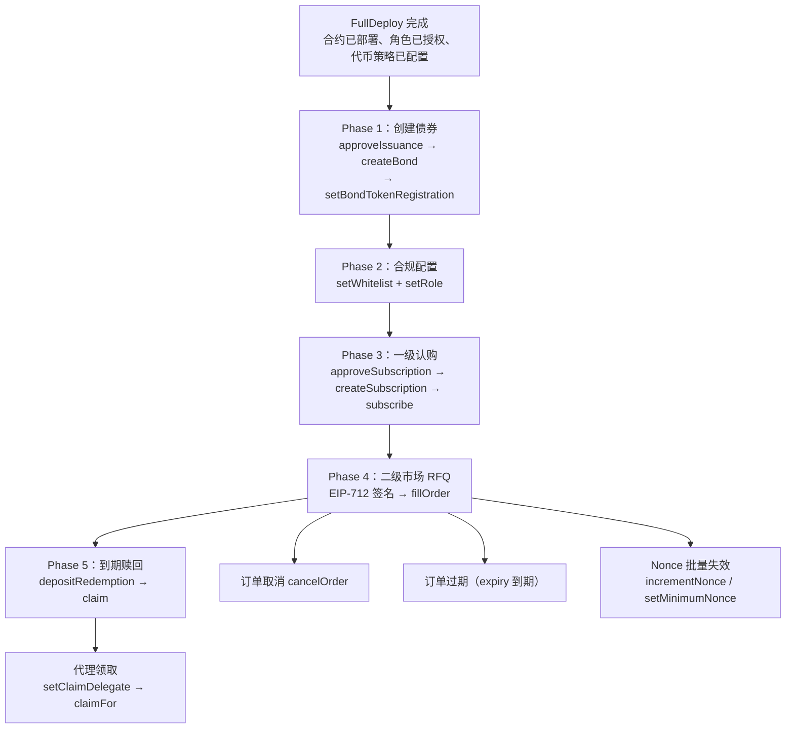

# BondDEX RFQ — 部署后操作手册

本文档说明 `FullDeploy` 完成后，如何从零开始让系统进入完整的业务运转状态。

---

## 总览：部署后全流程



---

## Phase 0：部署完成状态

`FullDeploy` 执行后，`deployments/{chainId}.json` 包含如下信息：

| 字段 | 含义 |
|------|------|
| `contracts.bondFactory` | BondFactory 地址（不可升级） |
| `contracts.bondIssuance` | BondIssuance 代理地址（UUPS 可升级） |
| `contracts.rfqSettlement` | RFQSettlement 代理地址（UUPS 可升级） |
| `contracts.complianceImplementation` | ComplianceModule 实现模板（已注册到 Factory） |
| `configuration.settlementTokens` | 已配置的结算代币及其策略 |
| `configuration.feeConfig` | RFQ 手续费配置 |
| `roles` | 各合约的角色持有者 |

**已完成的初始化：**
1. ComplianceModule 实现已注册到 Factory
2. 结算代币（如 USDC）已在 BondIssuance 和 RFQSettlement 上启用
3. RFQ 手续费（feeRecipient + currentFeeBps + maxFeeBps）已配置
4. 各合约角色已授权给配置中指定的地址
5. deployer 权限已选择性撤销（如配置 `revokeDeployer: true`）

---

## Phase 1：创建债券

### 1.1 审批发行

由 `ISSUANCE_APPROVER_ROLE` 持有者调用：

```solidity
factory.approveIssuance(
    bytes32 approvalId,           // 唯一审批 ID（自定义，如 keccak256("bond-2026-001")）
    address issuer,               // 发行人地址
    address complianceImplementation, // 合规模板地址（必须已在 Factory 注册）
    uint256 expiresAt,            // 审批有效期（Unix 时间戳，0 = 永不过期）
    bytes32 metadataHash          // 链下元数据引用（如 IPFS CID 的 keccak256）
);
```

**前置条件：** `complianceImplementation` 必须先通过 `registerComplianceImplementation` 注册，否则 `approveIssuance` 会 revert `UnsupportedInterface`。

**状态枚举：** `ApprovalStatus`：`NONE=0`（未使用）, `ACTIVE=1`, `CONSUMED=2`, `REVOKED=3`, `EXPIRED=4`。每个 `approvalId` 只能使用一次，不可覆写已有记录。

### 1.2 创建债券

由**发行人本人**调用（必须与 approvalId 中记录的 issuer 一致）：

```solidity
BondConfig memory config = BondConfig({
    issuer: 0x...,                    // 必须等于 msg.sender
    name: "HashKey Bond 2026-Q1",     // 债券名称
    symbol: "HKB-Q1",                 // 债券符号
    decimals: 0,                      // 债券精度（0 = 整数 bond, 18 = 标准）
    faceValue: 1_000e6,              // 面值（结算代币最小单位，如 1000 USDC = 1_000_000_000）
    couponRateBps: 500,              // 票息率 bps（500 = 5%，上限 10000）
    maturityTimestamp: 1735689600,    // 到期时间（Unix 时间戳）
    settlementToken: 0x...,          // 结算代币地址（必须已在平台启用）
    settlementTokenDecimals: 6,      // 结算代币精度（链下参考）
    complianceImplementation: 0x..., // 合规模板（必须与审批中一致且已注册）
    policyId: keccak256("policy-1"), // 合规策略 ID
    policyVersion: 1                 // 合规策略版本
});

(address bondToken, address complianceModule) = factory.createBond(config, approvalId);
```

**decimals 说明：**
- `decimals = 0`：每个 bond 为一个整数单位，适合面值计价场景（如 1 bond = 1000 USDC 面值）
- `decimals = 18`：标准精度，适合需要分割的场景
- 认购时 `cost = Math.mulDiv(unitPrice, units, 10^decimals, Ceil)`，decimals=0 时简化为 `unitPrice * units`

**输出：**
- `bondToken` — 新部署的 BondToken ERC-20 地址
- `complianceModule` — 该债券专属的 ComplianceModule 代理地址

### 1.3 注册债券到 RFQ 结算

创建债券后，需要将 bondToken 注册到 RFQSettlement 才能进行二级市场交易。由 `SETTLEMENT_ADMIN_ROLE` 持有者调用：

```solidity
settlement.setBondTokenRegistration(bondTokenAddress, true);
```

未注册的 bondToken 无法出现在 RFQ 订单中（`fillOrder` 会 revert `UnregisteredBondToken`）。这是一道安全防线，防止恶意用户用假的 bondToken 地址签署订单来骗取对手方的报价代币。

**查询是否已注册：**

```solidity
bool registered = settlement.isBondTokenRegistered(bondTokenAddress);
```

---

## Phase 2：合规配置

每支债券有独立的 ComplianceModule。由该模块的 `COMPLIANCE_ADMIN_ROLE` 持有者操作。

### 2.1 设置白名单

```solidity
// 单个
complianceModule.setWhitelist(account, true);

// 批量
address[] memory accounts = new address[](3);
accounts[0] = issuer;
accounts[1] = maker;
accounts[2] = investor;
bool[] memory allowed = new bool[](3);
allowed[0] = true;
allowed[1] = true;
allowed[2] = true;
complianceModule.batchSetWhitelist(accounts, allowed);
```

### 2.2 设置角色

```solidity
// Role 枚举: NONE=0, ISSUER=1, MARKET_MAKER=2, INVESTOR=3
complianceModule.setRole(issuer, Role.ISSUER);        // 1
complianceModule.setRole(maker, Role.MARKET_MAKER);    // 2
complianceModule.setRole(investor, Role.INVESTOR);     // 3
```

### 2.3 角色组合规则

| 发送方 | 接收方 | 允许? | 说明 |
|--------|--------|-------|------|
| MARKET_MAKER | INVESTOR | 是 | 最常见的交易方向 |
| INVESTOR | MARKET_MAKER | 是 | 投资者出售 |
| MARKET_MAKER | MARKET_MAKER | 是 | 做市商间交易（免手续费） |
| INVESTOR | INVESTOR | **否** | 禁止投资者间直接转让 |

---

## Phase 3：一级认购

### 3.1 审批认购窗口

由 `ISSUANCE_APPROVER_ROLE` 持有者调用（与债券发行审批类似的管控模式）：

```solidity
issuance.approveSubscription(
    bytes32 approvalId,          // 唯一审批 ID（自定义，如 keccak256("sub-2026-001")）
    address issuer,              // 发行人地址
    address bondToken,           // 债券代币地址
    uint256 maxUnits,            // 最大发行量上限（必须 > 0）
    uint256 expiresAt            // 审批有效期（Unix 时间戳，0 = 永不过期，非零时必须 > block.timestamp）
);
```

**约束：** `approvalId` 必须从未被使用过；`expiresAt` 如非零则必须是未来时间，否则 revert `ExpiredDeadline`。

### 3.2 创建认购窗口

由**发行人**调用（需要先获得管理员审批）：

```solidity
SubscriptionTerms memory terms = SubscriptionTerms({
    bondToken: bondTokenAddress,
    settlementToken: usdcAddress,
    unitPrice: 1_000e6,       // 每个 bond unit 的价格（结算代币最小单位）
    maxUnits: 1_000,          // 最大发行量（decimals=0 时为整数，不能超过审批上限）
    opensAt: block.timestamp, // 开始时间
    closesAt: block.timestamp + 7 days // 结束时间（0 = 无截止）
});

bytes32 offerId = issuance.createSubscription(terms, approvalId);
```

**约束：**
- `terms.maxUnits` 不能超过审批记录中的 `maxUnits` 上限
- `terms.bondToken` 必须与审批记录中的 `bondToken` 一致
- `msg.sender` 必须与审批记录中的 `issuer` 一致
- 每个审批只能使用一次（消费后状态变为 CONSUMED）
- 债券未到期（`block.timestamp < maturityTimestamp`），否则 `BondAlreadyMatured`

**注意：** `subscribe()` 同样会检查债券是否已到期，到期后无法再认购。

### 3.3 做市商认购

**前置条件：**
1. 做市商已白名单 + MARKET_MAKER 角色
2. 做市商持有足够结算代币（USDC）
3. 做市商已对 BondIssuance 合约 approve 足够 USDC

```solidity
// 做市商操作
usdc.approve(address(issuance), cost);
issuance.subscribe(offerId, 800); // 认购 800 个 bond units（decimals=0）
```

**资金流向：**
结算代币 → 发行人地址（直接转给 issuer）
BondToken → mint 给做市商

**查询剩余额度：**

```solidity
(, , , uint256 maxUnits, uint256 soldUnits, , , ) = issuance.getSubscription(offerId);
uint256 remaining = maxUnits - soldUnits;
```

### 3.4 关闭认购 / 撤销审批

```solidity
// 关闭认购窗口（发行人调用）
issuance.closeSubscription(offerId);

// 撤销未使用的认购审批（ISSUANCE_APPROVER_ROLE 调用）
issuance.revokeSubscriptionApproval(approvalId);
```

> 如果认购参数设置错误，发行人应先 `closeSubscription` 关闭当前认购，然后重新申请审批并创建新的认购窗口。

---

## Phase 4：二级市场 RFQ

### 4.1 EIP-712 签名（链下）

Maker 构造 Order 并用 EIP-712 TypedData 签名：

```
EIP712Domain:
  name: "BondDEX RFQSettlement"
  version: "1"
  chainId: {当前链 ID}
  verifyingContract: {RFQSettlement 代理地址}

Order:
  maker: address        // 签名者
  taker: address        // 指定 taker（0x0 = 任何人）
  bondToken: address    // 债券代币地址（必须已在 RFQSettlement 注册）
  quoteToken: address   // 报价代币地址（如 USDC）
  bondAmount: uint256   // 债券数量
  quoteAmount: uint256  // 报价代币数量
  side: uint8           // 0=BUY（taker 买入债券）, 1=SELL（taker 卖出债券）
  expiry: uint256       // 过期时间
  nonce: uint256        // maker nonce（必须 >= nonceFloor）
  salt: uint256         // 随机盐（防重复）
  maxFeeBps: uint16     // maker 允许的最高协议费率 bps（如 100 = 1%）
```

**手续费保护：** `maxFeeBps` 纳入 EIP-712 签名，执行时若 `currentFeeBps > maxFeeBps` 则 revert `FeeExceedsOrderLimit`。maker 可通过此字段锁定签名时的费率预期，防止管理员在签名后、成交前修改费率。

> **注意：** `maxFeeBps` 只保护签名方（maker）。当 taker 是实际承担手续费的做市商（例如 BUY 订单中 maker=Investor, taker=MM）时，taker 需要在提交 `fillOrder` 前自行通过 `feeConfig()` 确认当前费率可接受。

### 4.2 执行订单

**前置条件：**
- 债券代币已通过 `setBondTokenRegistration` 注册到 RFQSettlement
- 报价代币已在 RFQSettlement 启用
- 双方均已白名单 + 合规角色
- 付款方已对 RFQSettlement approve 足够代币
- 订单未过期、未消费、未取消

```solidity
// 单笔
settlement.fillOrder(order, signature);

// 批量（原子执行，全成功或全失败，上限 24 笔）
settlement.batchFillOrders(orders, signatures);
```

### 4.3 手续费规则

| maker 角色 | taker 角色 | 手续费 |
|-----------|-----------|--------|
| MARKET_MAKER | INVESTOR | currentFeeBps（从 MM 侧扣） |
| MARKET_MAKER | MARKET_MAKER | **0**（免手续费） |
| INVESTOR | MARKET_MAKER | currentFeeBps（从 MM 侧扣） |

手续费始终由做市商承担：
- BUY 单（taker 买债券）：maker=MM 收到 `quoteAmount - fee`
- SELL 单（taker 卖债券）：maker=MM 支付 `quoteAmount + fee`

**手续费计算（以 30 bps 为例）：**

```
fee = Math.mulDiv(quoteAmount, 30, 10000)

例：quoteAmount = 20,000 USDC
fee = 20,000,000,000 * 30 / 10,000 = 60,000,000 = 60 USDC
```

**预估手续费：**

```solidity
// bondToken 必须已通过 setBondTokenRegistration 注册，否则 revert UnregisteredBondToken
uint256 fee = settlement.quoteFee(bondToken, partyA, partyB, quoteAmount);
```

### 4.4 订单取消

```solidity
// 单笔取消（仅 maker 可调用）
settlement.cancelOrder(order);

// 批量取消（上限 24 笔）
settlement.batchCancelOrders(orders);
```

### 4.5 Nonce 管理

```solidity
// 递增 nonce floor（使所有 nonce < newFloor 的订单失效）
settlement.incrementNonce();

// 跳跃到指定 nonce（必须大于当前值）
settlement.setMinimumNonce(100);
```

### 4.6 订单过期

订单中 `expiry` 字段为 Unix 时间戳。`block.timestamp > expiry` 时自动拒绝执行，无需链上取消。

---

## Phase 5：到期赎回

### 5.1 发行人存入赎回资金

债券到期后，发行人将赎回资金存入 BondIssuance：

```solidity
// 发行人操作
usdc.approve(address(issuance), totalPayout);
issuance.depositRedemption(bondTokenAddress, totalPayout);
```

**赎回金额计算（decimals=0 时）：**

```
principal = bondAmount * faceValue
interest  = principal * couponRateBps / 10000
payout    = principal + interest

例：100 bonds, faceValue=1000 USDC, coupon=5%
  principal = 100 * 1,000,000,000 = 100,000 USDC
  interest  = 100,000 * 500 / 10000 = 5,000 USDC
  payout    = 105,000 USDC
```

**赎回金额计算（decimals=18 时）：**

```
principal = bondAmount * faceValue / 10^18
interest  = principal * couponRateBps / 10000
payout    = principal + interest

例：100e18 bonds, faceValue=1000e6, coupon=5%
  principal = 100e18 * 1000e6 / 1e18 = 100,000e6
  interest  = 100,000e6 * 500 / 10000 = 5,000e6
  payout    = 105,000e6
```

### 5.2 持有人领取

```solidity
// 持有人自己领取
issuance.claim(bondTokenAddress);
```

**效果：** burn 全部持有的 BondToken → 发放对应 payout 到持有人地址

### 5.3 代理领取

```solidity
// 持有人授权代理人
issuance.setClaimDelegate(delegateAddress);

// 代理人代为领取（资金仍发给持有人，不是代理人）
issuance.claimFor(bondTokenAddress, holderAddress);
```

### 5.4 多余资金救援

如果 issuer 存入了多余的赎回资金，admin 可以将多余部分取出：

```solidity
// DEFAULT_ADMIN_ROLE 调用
issuance.rescueTokens(usdcAddress, issuerAddress, excessAmount);
```

**安全保护：** 合约按 settlement token 汇总追踪所有 bond 系列的赎回负债（`_totalRedemptionLiability`）。`rescueTokens` 仅允许提取 `contractBalance - totalLiability` 的差额。若请求金额超出可救援余额，revert `InsufficientRescuableBalance`。

---

## Phase 6：运维操作

### 6.1 分域暂停

每个合约可独立暂停不同业务域。

> **注意：** `pauseDomain` 不是幂等操作。对已暂停的域再次调用暂停会 revert `DomainAlreadySet`。多签或自动化脚本在执行前应先调用 `isDomainPaused(domain)` 查询当前状态。

```solidity
// PauseDomain: FACTORY=0, SUBSCRIPTION=1, SETTLEMENT=2,
//              COMPLIANCE_ADMIN=3, REDEMPTION_FUNDING=4, CLAIMS=5

// 暂停 Factory 的债券创建
factory.pauseDomain(PauseDomain.FACTORY, true);

// 暂停 RFQ 交易
settlement.pauseDomain(PauseDomain.SETTLEMENT, true);

// 暂停一级认购
issuance.pauseDomain(PauseDomain.SUBSCRIPTION, true);

// 恢复
factory.pauseDomain(PauseDomain.FACTORY, false);
```

### 6.2 ComplianceModule 级暂停

可暂停特定债券的转账（影响该债券的所有 RFQ 交割）：

```solidity
complianceModule.pauseDomain(PauseDomain.SETTLEMENT, true);
```

也可暂停合规管理操作（`setWhitelist`/`setRole`/`setPolicyMetadata` 等）：

```solidity
complianceModule.pauseDomain(PauseDomain.COMPLIANCE_ADMIN, true);
```

暂停 `COMPLIANCE_ADMIN` 域后，所有白名单和角色变更操作将 revert `DomainPaused(COMPLIANCE_ADMIN)`。

### 6.3 平台管理员变更

`setPlatformAdmin(newAdmin)` 仅更新 `platformAdmin` 状态变量（影响新部署的 ComplianceModule 的初始管理员），**不等于完整的管理员权限移交**。调用后旧管理员仍持有 `DEFAULT_ADMIN_ROLE`。

完整权限移交流程：

```solidity
// 1. 更新 platformAdmin（影响新 ComplianceModule 初始管理员）
factory.setPlatformAdmin(newSafe);

// 2. 通过标准 AccessControl 移交角色
factory.grantRole(DEFAULT_ADMIN_ROLE, newSafe);  // 新管理员获得角色
factory.renounceRole(DEFAULT_ADMIN_ROLE, oldSafe); // 旧管理员放弃角色
```

### 6.4 紧急代币救援

误转到 BondIssuance 合约的代币可由 `DEFAULT_ADMIN_ROLE` 取出（赎回负债自动保护）：

```solidity
issuance.rescueTokens(tokenAddress, recipientAddress, amount);
```

---

## Anvil 全自动演示

运行 `make demo-anvil` 即可在本地 Anvil 上执行完整的端到端演示。

### 演示参数

| 参数 | 值 |
|------|-----|
| 债券精度 | decimals = 0（整数 bond） |
| 面值 | 1,000 USDC |
| 票息率 | 5%（500 bps） |
| RFQ 手续费 | 0.3%（30 bps） |
| 发行量 | 1,000 bonds |
| 认购单价 | 1,000 USDC |

### 演示场景

| 阶段 | 场景 | 预期结果 |
|------|------|---------|
| Phase 1 | 铸造 USDC（issuer 2M，其余 1M） | 所有人获得 USDC |
| Phase 2 | admin 审批 + issuer 创建 bond | BondToken + ComplianceModule 部署 |
| Phase 3 | 合规配置（makerC/investorC 不加白名单） | 6 人白名单，2 人被排除 |
| Phase 4 | makerA 认购 800 + makerB 认购 200 | 认购满额自动关闭 |
| Phase 4 | makerB 超额认购 500 | SubscriptionCapExceeded |
| Phase 4 | makerC 认购（不在白名单） | NotWhitelisted |
| Phase 5 | investorA 向 makerA/B 各买 10 | 成功，含手续费 |
| Phase 5 | investorB 向 makerB 买 190 | 成功 |
| Phase 5 | makerC 恶意报价 | NotWhitelisted |
| Phase 5 | investorC 想买 | NotWhitelisted |
| Phase 5 | investorA 卖 10 给 makerB（先取消再成交） | 取消成功 + 新单成交 |
| Phase 5 | investorA 向 makerA 买 90（先过期再成交） | 过期拒绝 + 新单成交 |
| Phase 5 | makerB 向 makerA 买 100（MM间） | 成功，无手续费 |
| Phase 6 | investorA 向 investorB 买 | InvestorToInvestorRestricted |
| Phase 7 | issuer 存入赎回资金（多存 50K） | 资金入池 |
| Phase 7 | makerA 设 delegate 代领 | delegate 代领成功 |
| Phase 7 | makerB 尝试代 makerA 领 | UnauthorizedClaimCaller |
| Phase 7 | 所有人领取赎回 | 核对余额 |
| Phase 7 | admin rescue 多余资金 | 50K USDC 回到 issuer |
| Phase 8 | Settlement 暂停/恢复 | 暂停后恢复正常 |

### RFQ 交易后余额快照

| 参与者 | Bond | USDC 变化说明 |
|--------|------|-------------|
| makerA | 600 | 初始 1M - 800K(认购) + 19,940(卖10@2000-fee) + 179,460(卖90@2000-fee) + 200,000(卖100@2000 MM间) |
| makerB | 110 | 初始 1M - 200K(认购) + 29,910(卖10@3000-fee) + 378,860(卖190@2000-fee) - 50,150(买10@5000+fee) - 200,000(买100@2000 MM间) |
| investorA | 100 | 初始 1M - 20,000(买10@2000) - 30,000(买10@3000) + 50,000(卖10@5000) - 180,000(买90@2000) |
| investorB | 190 | 初始 1M - 380,000(买190@2000) |

### 赎回后最终余额

每个 bond 赎回 1,050 USDC（本金 1,000 + 利息 50）：

| 参与者 | 赎回金额 |
|--------|---------|
| makerA (600 bonds) | 630,000 USDC |
| makerB (110 bonds) | 115,500 USDC |
| investorA (100 bonds) | 105,000 USDC |
| investorB (190 bonds) | 199,500 USDC |
| **合计** | **1,050,000 USDC** |

---

## 附录：Anvil 账户映射（本地测试）

| 索引 | 地址 | 私钥前缀 | 角色 | 白名单 |
|------|------|---------|------|--------|
| #0 | `0xf39Fd6...` | `0xac0974...` | deployer（已撤权） | - |
| #1 | `0x709979...` | `0x59c699...` | admin（platformAdmin） | 否 |
| #2 | `0x3C44Cd...` | `0x5de411...` | issuer（发行人） | 是 |
| #3 | `0x90F79b...` | `0x7c8521...` | makerA（做市商 A） | 是 |
| #4 | `0x15d34A...` | `0x47e179...` | makerB（做市商 B） | 是 |
| #5 | `0x996550...` | `0x8b3a35...` | makerC（做市商 C，未授权） | **否** |
| #6 | `0x976EA7...` | `0x92db14...` | investorA（投资者 A） | 是 |
| #7 | `0x14dC79...` | `0x4bbbf8...` | investorB（投资者 B） | 是 |
| #8 | `0x23618e...` | `0xdbda18...` | investorC（投资者 C，未授权） | **否** |
| #9 | `0xa0Ee7A...` | `0x2a871d...` | delegate（代理领取人） | 是 |

---

## 附录：常用 cast 查询命令

```bash
# 查询订单是否已消费
cast call $RFQ_SETTLEMENT "isOrderConsumed(bytes32)(bool)" $ORDER_HASH --rpc-url $RPC

# 查询订单是否已取消
cast call $RFQ_SETTLEMENT "isOrderCancelled(bytes32)(bool)" $ORDER_HASH --rpc-url $RPC

# 查询 maker 当前 nonce floor
cast call $RFQ_SETTLEMENT "currentNonce(address)(uint256)" $MAKER --rpc-url $RPC

# 查询手续费配置
cast call $RFQ_SETTLEMENT "feeConfig()((address,uint16,uint16))" --rpc-url $RPC

# 查询赎回状态
cast call $BOND_ISSUANCE "getRedemptionState(address)(uint256,uint256,uint256)" $BOND_TOKEN --rpc-url $RPC

# 查询认购信息
cast call $BOND_ISSUANCE "getSubscription(bytes32)(address,address,uint256,uint256,uint256,uint256,uint256,uint8)" $OFFER_ID --rpc-url $RPC

# 查询认购剩余额度
# 通过 getSubscription 返回的 maxUnits - soldUnits 计算

# 查询白名单状态
cast call $COMPLIANCE_MODULE "isWhitelisted(address)(bool)" $ACCOUNT --rpc-url $RPC

# 查询角色
cast call $COMPLIANCE_MODULE "roleOf(address)(uint8)" $ACCOUNT --rpc-url $RPC

# 查询债券代币是否已注册
cast call $RFQ_SETTLEMENT "isBondTokenRegistered(address)(bool)" $BOND_TOKEN --rpc-url $RPC

# 预估手续费
cast call $RFQ_SETTLEMENT "quoteFee(address,address,address,uint256)(uint256)" $BOND_TOKEN $PARTY_A $PARTY_B $QUOTE_AMOUNT --rpc-url $RPC

# 查询 ERC20 余额
cast call $TOKEN "balanceOf(address)(uint256)" $ACCOUNT --rpc-url $RPC
```

---

## 附录：Operations 模块化操作命令

所有操作通过 Makefile 调用 `Operations.s.sol`。通过 `ENV` 变量选择网络（默认 `anvil`），写入操作需要 `DEPLOYER_PRIVATE_KEY`：

```bash
# Anvil（默认，不需要 ENV）
make ops-query-fee-config
DEPLOYER_PRIVATE_KEY=0x... make ops-set-whitelist ARGS="..."

# 测试网
ENV=testnet make ops-query-fee-config
ENV=testnet DEPLOYER_PRIVATE_KEY=0x... make ops-set-whitelist ARGS="..."

# 主网（建议先不加 --broadcast 做 dry-run，确认后再正式执行）
ENV=mainnet DEPLOYER_PRIVATE_KEY=0x... make ops-set-whitelist ARGS="..."
```

完整命令列表：

```bash
# 债券创建
make ops-approve-issuance ARGS="<approvalId> <issuer> <expiresAt>"
make ops-create-bond ARGS="<approvalId> <name> <symbol> <decimals> <faceValue> <couponBps> <maturity> <token>"

# 合规配置
make ops-set-whitelist ARGS="<complianceModule> <account> <true|false>"
make ops-set-role ARGS="<complianceModule> <account> <roleUint8>"

# 一级认购
make ops-approve-subscription ARGS="<approvalId> <issuer> <bondToken> <maxUnits> <expiresAt>"
make ops-revoke-subscription-approval ARGS="<approvalId>"
make ops-create-subscription ARGS="<bondToken> <settlementToken> <unitPrice> <maxUnits> <opensAt> <closesAt> <approvalId>"
make ops-subscribe ARGS="<offerId> <units>"
make ops-close-subscription ARGS="<offerId>"

# 二级市场 RFQ
make ops-fill-order ARGS="<maker> <taker> <bondToken> <quoteToken> <bondAmt> <quoteAmt> <side> <expiry> <nonce> <salt>"
make ops-cancel-order ARGS="<maker> <taker> <bondToken> <quoteToken> <bondAmt> <quoteAmt> <side> <expiry> <nonce> <salt>"
make ops-increment-nonce
make ops-set-minimum-nonce ARGS="<newMinNonce>"

# 到期赎回
make ops-deposit-redemption ARGS="<bondToken> <amount>"
make ops-claim ARGS="<bondToken>"
make ops-claim-for ARGS="<bondToken> <holder>"
make ops-set-delegate ARGS="<delegateAddress>"
make ops-rescue-tokens ARGS="<token> <to> <amount>"

# 查询
make ops-query-subscription ARGS="<offerId>"
make ops-query-remaining-units ARGS="<offerId>"
make ops-query-subscription-approval ARGS="<approvalId>"
make ops-query-balance ARGS="<token> <account>"
make ops-query-bond-balances ARGS="<bondToken> [account1,account2,...]"
make ops-query-order ARGS="<orderHash>"
make ops-query-redemption ARGS="<bondToken>"
make ops-query-compliance ARGS="<complianceModule> <account>"
make ops-query-fee-config
make ops-query-nonce ARGS="<maker>"
make ops-query-fee ARGS="<bondToken> <partyA> <partyB> <quoteAmount>"
make ops-query-bond-token ARGS="<bondToken>"

# 运维
make ops-pause-factory ARGS="<domain> <true|false>"
make ops-pause-issuance ARGS="<domain> <true|false>"
make ops-pause-settlement ARGS="<domain> <true|false>"
make ops-pause-compliance ARGS="<complianceModule> <domain> <true|false>"
make ops-set-fee-config ARGS="<feeRecipient> <currentFeeBps> <maxFeeBps>"
make ops-set-bond-token ARGS="<bondToken> <true|false>"
make ops-mint-usdc ARGS="<to> <amount>"
make ops-approve-token ARGS="<token> <spender> <amount>"
```
